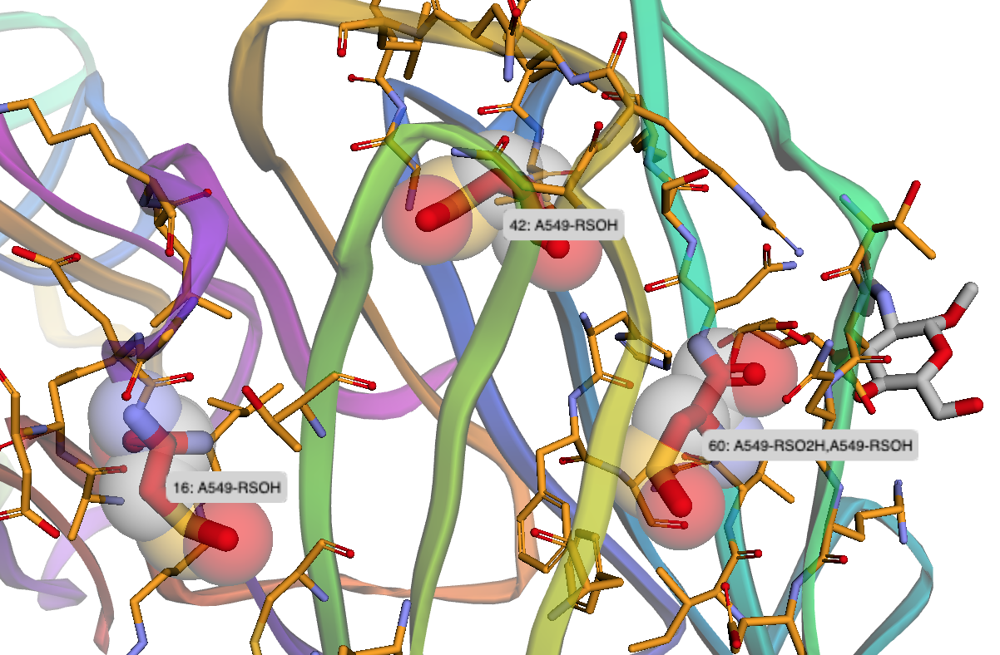

# mmtf-proteomics
An experimental project for mapping proteomic data onto 3D protein structures in Jupyter Notebooks.

Post-translational modifications (PTMs) modulate protein function. By mapping the locations of modified amino acid residues onto 3D protein structures, insights into the effect of PTMs can be obtained.

Example: Oxidated cysteines highlighted in a 3D protein structure.

---

# Notebooks

| Notebook | Description | Data Source |
|:-- |:-- |:--|
| [QueryPdbPTM.ipynb](https://nbviewer.jupyter.org/github/sbl-sdsc/mmtf-proteomics/blob/master/notebooks/QueryPdbPTM.ipynb) | Query and visualize PTMs present in PDB structures. | BioJava-ModFinder: identification of protein modifications in 3D structures from the Protein Data Bank. Gao J, Prlić A, Bi C Bluhm WF, Dimitropoulos D, Xu D Bourne, PE, Rose PW, Bioinformatics (2017) 33: 2047–2049. [doi: doi.org/10.1093/bioinformatics/btx101](https://doi.org/10.1093/bioinformatics/btx101) |
| [QueryDbPTM.ipynb](https://nbviewer.jupyter.org/github/sbl-sdsc/mmtf-proteomics/blob/master/notebooks/QueryDbPTM.ipynb) | Query and visualize PTMs from the dbPTM database. | dbPTM 2016: 10-year anniversary of a resource for post-translational modification of proteins. Huang KY, Su MG, Kao HJ, Hsieh YC, Jhong JH, Cheng KH, Huang HD, Lee TY, Nucleic Acids Res. (2016) 44(D1):D435-46. [doi: doi.org/10.1093/bioinformatics/btx101](https://doi.org/10.1093/bioinformatics/btx101) |
| [BrowseDbPTM.ipynb](https://nbviewer.jupyter.org/github/sbl-sdsc/mmtf-proteomics/blob/master/notebooks/BrowseDbPTM.ipynb) | Browse and visualize PTMs from the dbPTM database by type of PTM.| dbPTM 2016: 10-year anniversary of a resource for post-translational modification of proteins. Huang KY, Su MG, Kao HJ, Hsieh YC, Jhong JH, Cheng KH, Huang HD, Lee TY, Nucleic Acids Res. (2016) 44(D1):D435-46. doi: [doi.org/10.1093/bioinformatics/btx101](https://doi.org/10.1093/bioinformatics/btx101) |
| [CysOxidationInPDB.ipynb](https://nbviewer.jupyter.org/github/sbl-sdsc/mmtf-proteomics/blob/master/notebooks/CycOxidationInPDB.ipynb) | Find and visualize oxidized forms of L-cysteine in the PDB. |BioJava-ModFinder: identification of protein modifications in 3D structures from the Protein Data Bank. Gao J, Prlić A, Bi C Bluhm WF, Dimitropoulos D, Xu D Bourne, PE, Rose PW, Bioinformatics (2017) 33: 2047–2049. doi:[doi.org/10.1093/bioinformatics/btx101](https://doi.org/10.1093/bioinformatics/btx101)|
| [CysOxidationTo 3DStructure.ipynb](https://nbviewer.jupyter.org/github/sbl-sdsc/mmtf-proteomics/blob/master/notebooks/CycOxidationTo3DStructure.ipynb) | Map and visualize cysteine oxidations for the proteomics study by Akter et al. | Chemical proteomics reveals new targets of cysteine sulfinic acid reductase. Akter S, Fu L, Jung Y, Conte ML, Lawson JR, Lowther WT, Sun, Liu, Yang J, Carroll KS, Nat Chem Biol. (2018) Sep 3. doi: [10.1038/s41589-018-0116-2](https://doi.org/10.1038/s41589-018-0116-2) |
| [CysOxidationProteomicAnd StructuralEvidence.ipynb](https://nbviewer.jupyter.org/github/sbl-sdsc/mmtf-proteomics/blob/master/notebooks/CysOxidationProteomicAndStructuralEvidence.ipynb) | Find and visualize 3D structural evidence for the proteomics study by Akter et al. | Chemical proteomics reveals new targets of cysteine sulfinic acid reductase. Akter S, Fu L, Jung Y, Conte ML, Lawson JR, Lowther WT, Sun, Liu, Yang J, Carroll KS, Nat Chem Biol. (2018) Sep 3. doi: [10.1038/s41589-018-0116-2](https://doi.org/10.1038/s41589-018-0116-2) |
| [PTMsigDbTo 3DStructure.ipynb](https://nbviewer.jupyter.org/github/sbl-sdsc/mmtf-proteomics/blob/master/notebooks/PTMsigDbTo3DStructure.ipynb) | Map and visualize phosphorylation sites from PTMsigDB, a collection of modification site-specific signatures of perturbations, kinase activities and signaling pathways. | A Curated Resource for Phosphosite-specific Signature Analysis. Krug K, Mertins P, Zhang B, Hornbeck P, Raju R, Ahmad R, Szucs M, Mundt F, Forestier D, Jane-Valbuena J, Keshishian H, Gillette MA, Tamayo P, Mesirov JP, Jaffe JD, Carr SA and Mani DR, Molecular & Cellular Proteomics (2019). doi: [10.1074/mcp.TIR118.000943](https://doi.org/10.1074/mcp.TIR118.000943) |
| [S-SulphenylationTo 3DStructure.ipynb](https://nbviewer.jupyter.org/github/sbl-sdsc/mmtf-proteomics/blob/master/notebooks/S-SulphenylationTo3DStructure.ipynb) | Map and visualize S-sulphenylations sites. | Diverse Redoxome Reactivity Profiles of Carbon Nucleophiles. Gupta V, Yang J, Liebler DC, Carroll KS, J Am Chem Soc. (2017) 139(15):5588-5595. doi: [10.1021/jacs.7b01791](https://doi.org/10.1021/jacs.7b01791)|

## Run notebooks in your Web Browser
The Jupyter Notebooks in this repository can be run in your web browser using two freely available servers: CyVerse/VICE and Binder. Click on the launch buttons below to launch Jupyter Lab. **It may take several minutes for Jupyter Lab to launch.**

#### CyVerse/VICE
The[VICE (Visual Interactive Computing Environment)](https://cyverse-visual-interactive-computing-environment.readthedocs-hosted.com/en/latest/index.html) in the [CyVerse Discovery Environment](https://www.cyverse.org/discovery-environment) enables users to run Jupyter Lab in a production environment. To use VICE, sign up for a free [CyVerse account](https://www.cyverse.org/create-account). 

The VICE environment supports large-scale analyses. Users can upload and download files, and save and share results of their analyses in their user accounts (up to 100GB of data). 

[Follow these step to run Jupyter Lab on VICE](docs/vice_instructions.md) 

#### Binder
[Binder](https://mybinder.org/) is a platform for reproducible research developed by [Project Jupyter](https://jupyter.org/). Learn more about [Binder](https://blog.jupyter.org/mybinder-org-serves-two-million-launches-7543ae498a2a). 

Binder provides an easy to use demo environment. Due to resoure limitations, Binder is not suitable for compute or memory intensive production analyses and may fail to run some of the notebooks in this repository.

## Local Installation

[Mac and Linux](/docs/MacLinuxInstallation.md)

[Windows](/docs/WindowsInstallation.md)

## Feature Requests and Collaborations
Please send [feedback or feature requests](https://github.com/sbl-sdsc/mmtf-proteomics/issues/new).

Interested in a collaboration? Please send us use cases. 

## How to Cite this Work

Valasatava Y, Bradley AR, Rose AS, Duarte JM, Prlić A, Rose PW (2017) Towards an efficient compression of 3D coordinates of macromolecular structures. PLOS ONE 12(3): e0174846. doi: [10.1371/journal.pone.01748464](https://doi.org/10.1371/journal.pone.0174846)

#### CyVerse
Merchant N, Lyons E, Goff S, Vaughn M, Ware D, Micklos D, et al. (2016) The iPlant Collaborative: Cyberinfrastructure for Enabling Data to Discovery for the Life Sciences. PLoS Biol 14(1): e1002342. doi: [10.1371/journal.pbio.1002342](https://doi.org/10.1371/journal.pbio.1002342)

Goff, Stephen A., et al. (2011) The iPlant Collaborative: Cyberinfrastructure for Plant Biology. Frontiers in Plant Science 2. doi: [10.3389/fpls.2011.00034](https://doi.org/10.3389/fpls.2011.00034)

#### Binder
Project Jupyter, et al. (2018) Binder 2.0 - Reproducible, Interactive, Sharable Environments for Science at Scale. Proceedings of the 17th Python in Science Conference. 2018. doi: [10.25080/Majora-4af1f417-011](https://doi.org/10.25080/Majora-4af1f417-011)

#### Py3Dmol
Rego N, Koes, D (2015) 3Dmol.js: molecular visualization with WebGL, Bioinformatics 31, 1322–1324. doi: [10.1093/bioinformatics/btu829](https://doi.org/10.1093/bioinformatics/btu829)

## Funding
The MMTF project (Compressive Structural BioInformatics: High Efficiency 3D Structure Compression) is supported by the National Cancer Institute of the National Institutes of Health under Award Number U01CA198942. The content is solely the responsibility of the authors and does not necessarily represent the official views of the National Institutes of Health.

The CyVerse project is supported by the National Science Foundation under Award Numbers DBI-0735191,  DBI-1265383, and DBI-1743442. URL: www.cyverse.org
